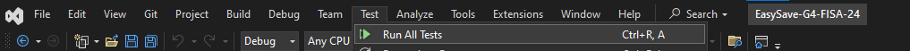

# Easy Save

## Introduction 

livrable 1 contains the first functional version of EasySave, as specified by ProSoft. 

This version initiates the development of a .NET Core console application for managing backup tasks.

### Prerequisites

1.	Installation process

* Clone the livrable-1 branch and open the project with Visual Studio 2022. 
* Make sure you have installed .NET Core 6.0.

2.	Software dependencies

* .NET Core 6.0
* Visual Studio 2022

## Execute Easy Save
#### Windows
Run EasySave.exe in directory ``../G4-FISA-24/EasySave-G4-FISA-24/EasySave/bin/Debug/net6.0/EasySave.exe``.

#### Linux
Run ``./EasySave`` after publishing from visual studio.

## Publishing EasySave


You need to specify the 'Target runtime' according to the operating system.


### Tests

Open the Test Explorer in Visual Studio and run the unit tests.




All tests are tested during the CI/CD phase, but it's best to run the tests before pushing.

### Latest versions

Please consult the "releases" tab to access the latest version of livrable 1 (Pipelines -> Releases):

https://dev.azure.com/faikmehmeti/G4-FISA-24/_release?_a=releases&view=mine&definitionId=1

### Build and test

* A download request to the develop-livrable-1 branch automatically triggers a build and test process (unit tests only).

* A pull request to the livrable-1 branch automatically triggers a continuous integration process, from build and test to release.

These processes can be visualized via pipelines: https://dev.azure.com/faikmehmeti/G4-FISA-24/_build

NOTES: A single agent can manage the execution of a single pipeline; parallelism is not possible.

### Features
- Sequential backup
- Daily logs
- Status logsv
- Select language
- List jobs
- Load job configuration
- Create a job
- Delete a job
- Launch jobs

### Console application entry point

``` csharp
using View = EasySave.Views.View;
namespace EasySave // Note: actual namespace depends on the project name.
{
    /// <summary>
    /// Application entry point
    /// </summary>
    internal class Program
    {
        [STAThread]
        static void Main(string[] args)
        {
            View pView = new View();
            //Lance le program principale
            pView.Run();
        }
    }
}
```

### Architecture


 The architecture is based on an MVVM model with :

- **Models** : classes representing data ([CJob](https://charifmah.github.io/EasySaveWiki/api/Models.Backup.CJob.html), [CJobManager](https://charifmah.github.io/EasySaveWiki/api/Models.Backup.CJobManager.html), [CSettings](https://charifmah.github.io/EasySaveWiki/api/Models.CSettings.html), etc.)
- **Views**: classes representing views ([BaseView](https://charifmah.github.io/EasySaveWiki/api/EasySave.Views.BaseView.html), [View](https://charifmah.github.io/EasySaveWiki/api/EasySave.Views.View.html), [JobView](https://charifmah.github.io/EasySaveWiki/api/EasySave.Views.JobView.html), etc.).
- **ViewModels**: classes linking models and views.

### Log System

Default location of [CJobManager](https://charifmah.github.io/EasySaveWiki/api/Models.Backup.CJobManager.html) and [CSettings](https://charifmah.github.io/EasySaveWiki/api/Models.Backup.CJobManager.html) and location of [log model](https://charifmah.github.io/EasySaveWiki/api/LogsModels.html) stored using the logging classes in the [Logs](https://charifmah.github.io/EasySaveWiki/api/LogsModels.html) package.

The current location of event logs is stored in the ``Logs`` folder.

The current location of user settings is stored in the root directory ``Settings.json``.

The location of backup jobs is stored in the ``Jobs`` folder.

Logs with names formatted as ``Logs - 2024-02-15`` are daily logs.

The ``Logs.json`` file is the log status.

# Continuous Integration (CI) and Continuous Deployment (CD) processes using Azure DevOps

## Continuous Integration configuration

### Triggering pipelines
Continuous integration pipelines are configured to trigger automatically when a pull request is made to the main branch. Continuous integration validation is a prerequisite for any code merge.

### Integration process

- Build: Compilation of source code into an executable or deployable package.
- Automated Testing: Execution of tests to verify code quality and functionality.
- Release Publishing: Creation and storage of release artifacts in Azure DevOps.


## Continuous Deployment Management

Although continuous integration is automated, continuous deployment currently requires manual intervention.

### Access to Releases

[https://dev.azure.com/faikmehmeti/G4-FISA-24/_release](https://dev.azure.com/faikmehmeti/G4-FISA-24/_release?_a=releases&view=mine&definitionId=1)


Here you can track the deployment status of each release.

This link allows you to follow the deployment status for each release.


### Deployment Management

By selecting a release, you will be taken to a page where continuous deployment can be managed. Currently, deployments must be performed manually for each stage.


