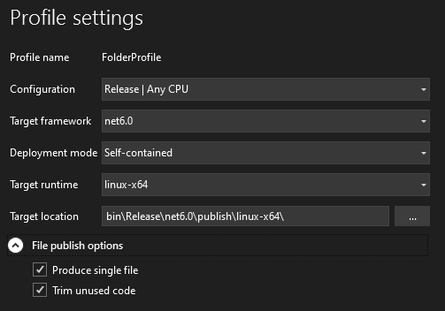
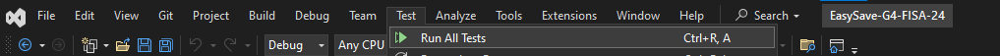
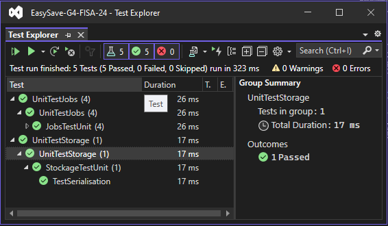
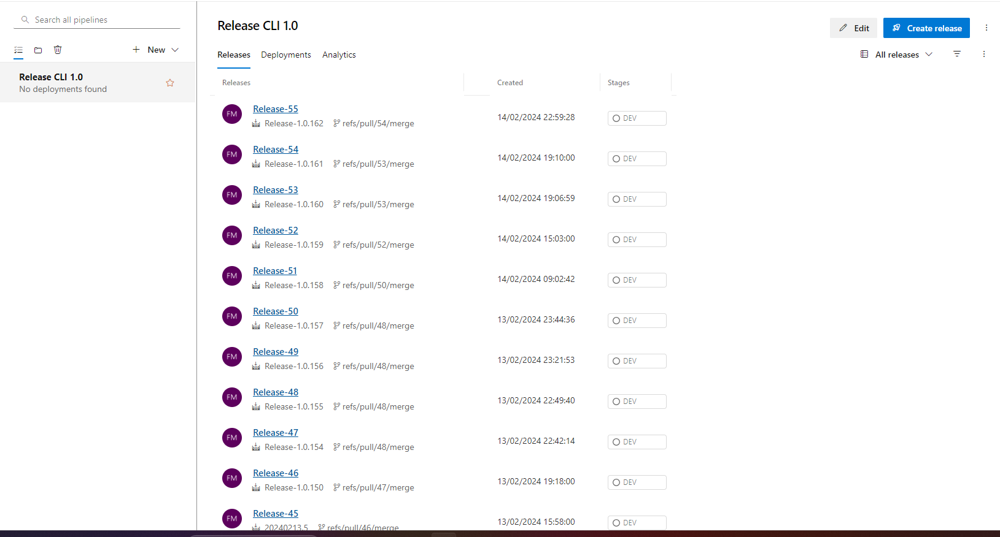
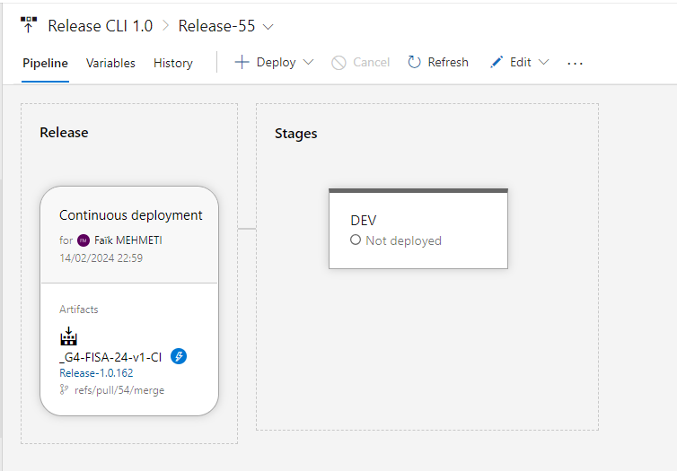

# Easy Save

## Introduction 

Le livrable 1 contient la première version fonctionnelle d'EasySave, conformément aux spécifications de ProSoft. 

Cette version initie le développement d'une application console .NET Core pour la gestion des tâches de sauvegarde.

### Prérequis

1.	Processus d'installation

* Cloner la branche livrable-1 et ouvrir le projet avec Visual Studio 2022. 
* Assurez-vous d'avoir installé .NET Core 6.0.

2.	Dépendances logicielles

* .NET Core 6.0
* Visual Studio 2022

## Executer Easy Save
#### Windows
Lancer EasySave.exe dans le répertoire ``../G4-FISA-24/EasySave-G4-FISA-24/EasySave/bin/Debug/net6.0/EasySave.exe``.

#### Linux
Exécutez ``./EasySave`` apres avoir fait la publication depuis visual studio.

## Publication de EasySave


Il faut specifier le 'Target runtime' en fonction du système d'exploitation



### Tests

Ouvrez l'explorateur de tests dans Visual Studio et exécutez les tests unitaires.





Tous les tests sont testés pendant la phase CI/CD, mais il est préférable d'exécuter les tests avant de 'push'.

### Dernières versions

Veuillez consulter l'onglet "releases" pour accéder à la dernière version du livrable 1 (Pipelines -> Releases) :

https://dev.azure.com/faikmehmeti/G4-FISA-24/_release?_a=releases&view=mine&definitionId=1

### Fonctionnalités
- Sauvegarde séquentielle
- Journaux quotidiens
- Journaux d'état
- Choisir la langue
- Lister les jobs
- Charger une configuration de Jobs
- Créer un job
- Supprimer un job
- Lancer les jobs

### Point d'entrée de l'application console

``` csharp
using View = EasySave.Views.View;
namespace EasySave // Note: actual namespace depends on the project name.
{
    /// <summary>
    /// Application entry point
    /// </summary>
    internal class Program
    {
        [STAThread]
        static void Main(string[] args)
        {
            View pView = new View();
            //Lance le program principale
            pView.Run();
        }
    }
}
```

### Architecture


 L'architecture est basée sur un modèle MVVM avec :

- **Modèles** : classes représentant les données ([CJob](https://charifmah.github.io/EasySaveWiki/api/Models.Backup.CJob.html), [CJobManager](https://charifmah.github.io/EasySaveWiki/api/Models.Backup.CJobManager.html), [CSettings](https://charifmah.github.io/EasySaveWiki/api/Models.CSettings.html), etc.)
- **Vues** :  classes représentant les vues ([BaseView](https://charifmah.github.io/EasySaveWiki/api/EasySave.Views.BaseView.html), [View](https://charifmah.github.io/EasySaveWiki/api/EasySave.Views.View.html), [JobView](https://charifmah.github.io/EasySaveWiki/api/EasySave.Views.JobView.html), etc.)
- **ViewModels** : classes faisant le lien entre modèles et vues.

### Systeme de Log

Emplacement par defaut du [CJobManager](https://charifmah.github.io/EasySaveWiki/api/Models.Backup.CJobManager.html) et [CSettings](https://charifmah.github.io/EasySaveWiki/api/Models.Backup.CJobManager.html) et l'emplacement des [modèle de logs](https://charifmah.github.io/EasySaveWiki/api/LogsModels.html) stockée grace aux classes de journalisation dans le package [Logs](https://charifmah.github.io/EasySaveWiki/api/LogsModels.html)

L'emplacement actuel des journaux d'événements est stocké dans le dossier ``Logs``.

L'emplacement actuel des paramètres de l'utilisateur est stocké dans le répertoire racine ``Settings.json``.

L'emplacement des tâches de sauvegarde est stocké dans le dossier ``Jobs``.

Les logs dont le nom est formaté dans ce type ``Logs - 2024-02-15`` sont des logs journalier.

Le fichier ``Logs.json`` est l'état du journal.


# Processus d'intégration continue (CI) et de déploiement continu (CD) utilisant Azure DevOps

## Configuration de l'Intégration Continue

### Déclenchement des Pipelines

Les pipelines d'intégration continue sont configurés pour se déclencher automatiquement lors d'un pull request vers la branche principale. La validation de l'intégration continue est un prérequis avant toute fusion de code.

### Processus d'Intégration

- Build : Compilation du code source en un exécutable ou en un paquet déployable.
- Tests Automatisés : Exécution de tests pour vérifier la qualité et la fonctionnalité du code.
- Publication des Releases : Création et stockage des artefacts de release dans Azure DevOps.


## Gestion du Déploiement Continu

Bien que l'intégration continue soit automatisée, le déploiement continu nécessite actuellement une intervention manuelle.

### Accès aux Releases

[https://dev.azure.com/faikmehmeti/G4-FISA-24/_release](https://dev.azure.com/faikmehmeti/G4-FISA-24/_release?_a=releases&view=mine&definitionId=1)



Vous pourriez suivre ici l'état de déploiement pour chaque release

Ce lien permet de suivre l'état de déploiement pour chaque release.


### Gestion du Déploiement

En sélectionnant une release, vous serez dirigé vers une page où le déploiement continu peut être géré. Actuellement, les déploiements doivent être effectués manuellement pour chaque étape (Stages).


