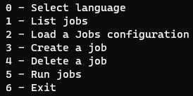

# EasySave 1.0 User Guide

## Start application

Run the EasySave.exe file

EasySave requires .NET version 6 or higher. It is compatible with the following operating systems:

- Windows 7 and later
- macOS 10.13 and higher
- Linux with distributions based on Debian/Ubuntu or Red Hat/CentOS

On Linux, copy-and-paste keyboard shortcuts are not available, but the application remains usable. On Linux with a graphical interface, the xsel utility must be installed to use Ctrl-C/Ctrl-V shortcuts.

#### Main menu

The main menu is displayed :

#### Keyboard shortcuts

EasySave supports the following keyboard shortcuts:

- **CTRL+C** : Clear console contents
- **CTRL+V** : Paste clipboard contents into console.
  These shortcuts let you quickly interact with the interface without using the mouse.

#### Choose language

Selects the interface language from among the supported languages.

#### List jobs

Displays the list of configured backup profiles

#### Load job configuration

Imports parameters from an existing configuration file

#### Create job

Configures a new backup profile

#### Delete a job

Permanently deletes a selected backup profile

#### Start jobs

Starts manual backups
