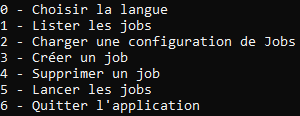

# Guide d'utilisation EasySave 1.0

## Démarrer l'application

Exécuter le fichier EasySave.exe

EasySave requiert la version .NET 6 ou supérieure. Il est compatible avec les systèmes d'exploitation suivants :

- Windows 7 et versions ultérieures
- macOS 10.13 et versions ultérieures
- Linux avec les distributions basées sur Debian/Ubuntu ou Red Hat/CentOS

Sur Linux, les raccourcis clavier de copier-coller ne sont pas disponibles, mais l'application reste utilisable. Sur Linux avec interface graphique, l'utilitaire xsel doit être installé pour l'utilisation des raccourcis Ctrl-C/Ctrl-V.

#### Menu principal

Le menu principal s'affiche :

#### Raccourcis clavier

EasySave prend en charge les raccourcis clavier suivants:

- **CTRL+C** : Effacer le contenu de la console
- **CTRL+V** : Coller le contenu du presse-papier dans la console.
  Ces raccourcis permettent d'interagir rapidement avec l'interface sans utiliser la souris.

#### Choisir la langue

Permet de sélectionner la langue d'interface parmi les langues supportées

#### Lister les jobs

Affiche la liste des profils de sauvegarde configurés

#### Charger une configuration de Jobs

Importe les paramètres d'un fichier de configuration existant

#### Créer un job

Configure un nouveau profil de sauvegarde

#### Supprimer un job

Supprime définitivement un profil de sauvegarde sélectionné

#### Lancer les jobs

Démarre les sauvegardes planifiées ou manuelles
