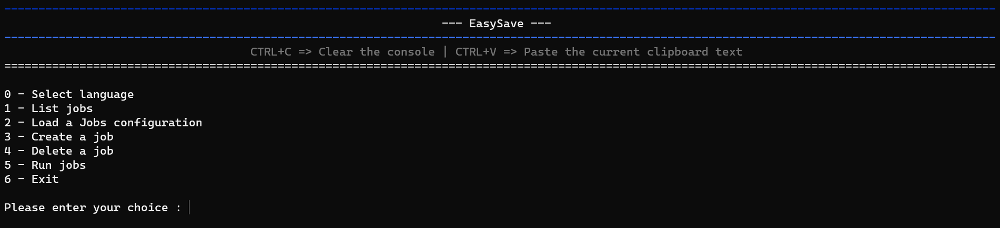
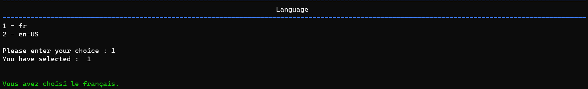
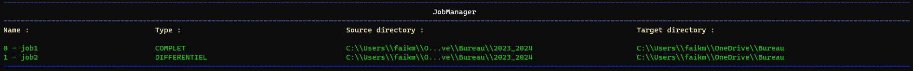
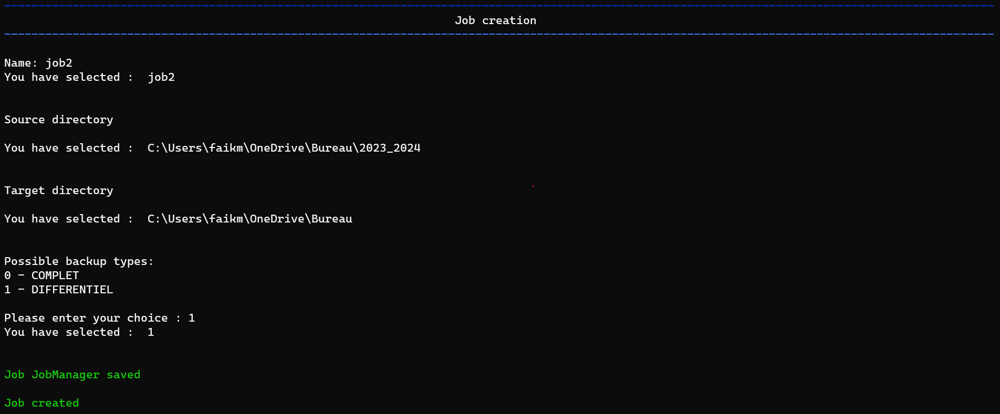
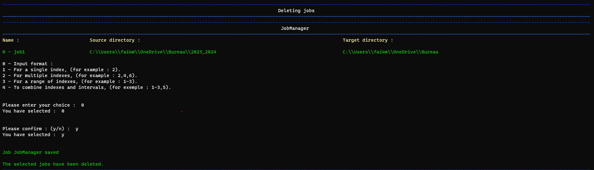
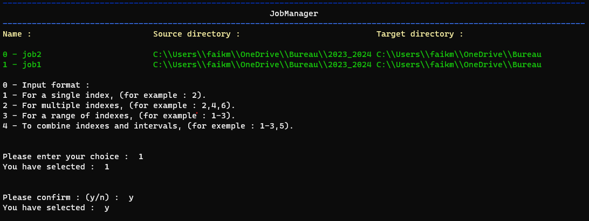

# EasySave 1.0 Release Notes

## **14-02-2024**

We are delighted to announce the launch of EasySave 1.0, a backup application designed to meet the needs of professional users.

This first release provides a series of features designed to simplify the management of your backups.

## Main features

### - Interactive menu

As soon as you start EasySave, you'll be guided by a simplified interactive menu, designed to make it easy to access and manage your backups.

This user-friendly interface lets you navigate easily between the application's various functions, making the user experience fluid and straightforward.

With options clearly laid out, you can quickly configure, run and manage your backup tasks, ensuring efficient, personalized use of EasySave right from the start.

### Multilingual support

EasySave is available to both English- and French-speaking users, with a simple, intuitive command-line user interface.

### - View list of backup jobs

Easily access a list of all your backup jobs, including full configuration information.

### - Customize backup job configuration file

You can import an existing configuration file for your backup jobs, or restore the default file originally assigned.

### - Manage multiple backup jobs

Configure up to five backup jobs, customizable by name, source directory, target directory and backup mode (full or differential).

### - Full and differential backup

Full: Copies all your files on each run, guaranteeing complete restoration.

Differential: Copies only files that have changed since the last backup.

### - Flexible deletion of backup jobs

In a similar way, the deletion of backup jobs in EasySave uses the same selection principle.

By specifying "2-4,6", users can delete jobs 2 to 4 and job 6 quickly and easily. This feature ensures convenient, straightforward management of your backup plan, enabling you to keep your configuration up to date with little effort.

### - Customized execution of backup jobs

EasySave makes the selection of backup jobs extremely flexible, giving users the ability to choose precisely which backups to run.

For example, by entering "1-3.5", the system will run jobs 1-3 and job 5 in a single operation.

This simplified method allows you to select ranges of tasks (such as "1-3") and add individual tasks (such as "5") by separating them with commas, making it easy to customize your backups.

### - Extended backup location support

Compatible with various types of storage, including local, external and network drives.

### - Daily logging

Detailed monitoring of backup operations is recorded daily in a log file in JSON format. This file includes information such as timestamp, job name, source and target file paths, file size and transfer duration.

### - Real-time monitoring

A status file in JSON format, updated in real time, lets you track the progress of your backups. It displays the number of files remaining to be backed up, as well as their total size.

In addition to being able to view the progress of your backups in this file, you also have the option of tracking the progress of backup tasks directly on the application as these tasks are executed.

### - File configuration and location

Locations for log and status files have been optimized to work reliably on customer servers, avoiding standard local paths and making JSON files easier to access and read.
