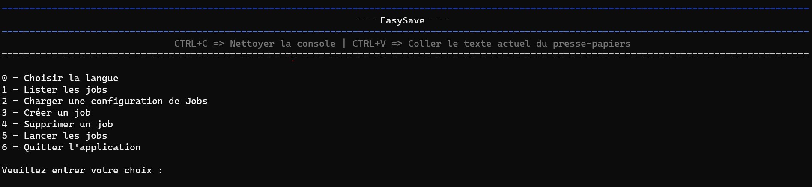
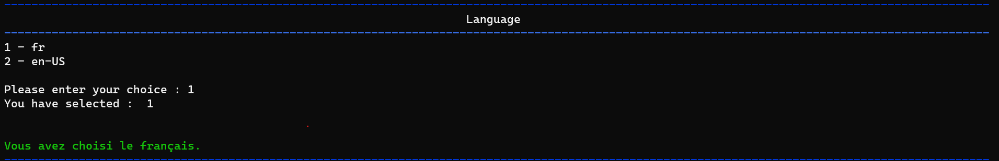
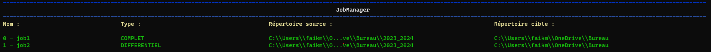
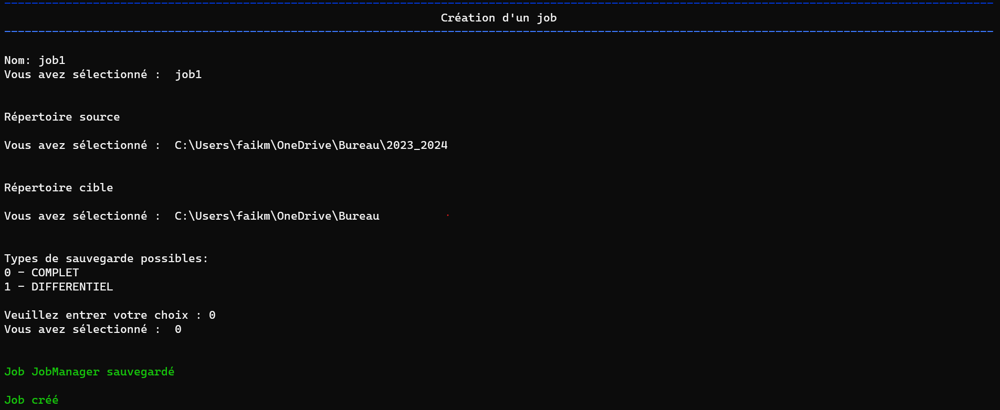
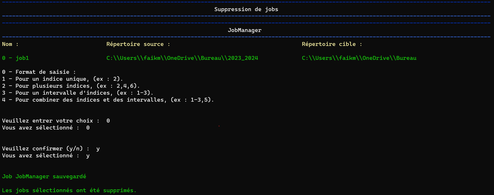
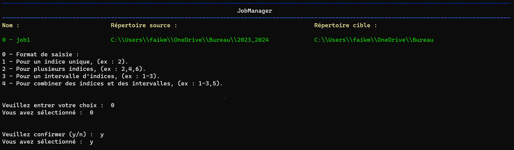

# Notes de publication EasySave 1.0

## **14-02-2024**

Nous sommes ravis d'annoncer le lancement d'EasySave 1.0, une application de sauvegarde conçue pour répondre aux besoins des utilisateurs professionnels.

Cette première version fournit une série de fonctionnalités destinées à simplifier la gestion de vos sauvegardes.

## Fonctionnalités principales

#### Menu Interactif

Dès le démarrage d'EasySave, vous êtes guidé par un menu interactif simplifié, conçu pour faciliter l'accès et la gestion de vos sauvegardes.

Cette interface conviviale vous permet de naviguer aisément entre les différentes fonctionnalités de l'application, rendant l'expérience utilisateur fluide et directe.

Avec des options clairement présentées, vous pouvez rapidement configurer, exécuter et gérer vos tâches de sauvegarde, assurant une utilisation efficace et personnalisée d'EasySave dès le début.

#### Support multilingue

EasySave est accessible aux utilisateurs anglophones et francophones, avec une interface utilisateur en ligne de commande simple et intuitive.

#### Visualisation de la liste des travaux de sauvegarde

Accédez facilement à une liste de tous vos travaux de sauvegarde, incluant les informations complètes sur leur configuration.

#### Personnalisation du fichier de configuration des travaux de sauvegarde

Vous pouvez importer un fichier de configuration existant pour vos travaux de sauvegarde ou rétablir le fichier par défaut initialement attribué.

#### Gestion de multiples tâches de sauvegarde

Configurez jusqu'à cinq tâches de sauvegarde, personnalisable par un nom, un répertoire source, un répertoire cible, ainsi qu'un mode de sauvegarde (complet ou différentiel).

#### Sauvegarde complet et différentiel

Complet : Copie l'ensemble de vos fichiers à chaque exécution, garantissant une restauration complète.

Différentiel : Copie uniquement les fichiers modifiées en fonction de la date, depuis la dernière sauvegarde.

#### Suppression Flexible des Tâches de Sauvegarde

De façon similaire, la suppression des tâches de sauvegarde dans EasySave utilise le même principe de sélection.

En spécifiant "2-4,6", les utilisateurs peuvent supprimer les tâches 2 à 4 et la tâche 6 rapidement et facilement. Cette fonctionnalité assure une gestion pratique et directe de votre plan de sauvegarde, vous permettant de maintenir votre configuration à jour avec peu d'effort.

#### Exécution Personnalisée des travaux de sauvegarde

EasySave rend la sélection des tâches de sauvegarde extrêmement flexible, offrant aux utilisateurs la capacité de choisir précisément les sauvegardes à exécuter.

Par exemple, en entrant "1-3,5", le système lancera les tâches 1 à 3 et la tâche 5 en une seule opération.

Cette méthode simplifiée permet de sélectionner des plages de tâches (comme "1-3") et d'ajouter des tâches individuelles (comme "5") en les séparant par des virgules, facilitant ainsi la personnalisation de vos sauvegardes.

#### Prise en charge étendue des emplacements de sauvegarde

Compatible avec divers types de stockage, y compris les disques locaux, externes, et les lecteurs réseau.

#### Journalisation quotidienne

Un suivi détaillé des opérations de sauvegarde est consigné quotidiennement dans un fichier journal au format JSON. Ce fichier comprend des informations telles que l'horodatage, le nom de la tâche, les chemins des fichiers sources et cibles, la taille des fichiers ainsi que la durée du transfert.

#### Suivi en temps réel

Un fichier d'état au format JSON, mis à jour en temps réel, vous permet de suivre la progression de vos sauvegardes. Il affiche le nombre de fichiers restants à sauvegarder ainsi que leur taille totale.

En plus de pouvoir visualiser la progression de vos sauvegardes dans ce fichier, vous avez également la possibilité de suivre l'état d'avancement des tâches de sauvegarde directement sur l'application lors de l'exécution de ces tâches.

#### Configuration et localisation des fichiers

Les emplacements pour les fichiers log et d'état ont été optimisés pour fonctionner de manière fiable sur les serveurs des clients, évitant les chemins locaux standards et facilitant l'accès et la lecture des fichiers JSON.
